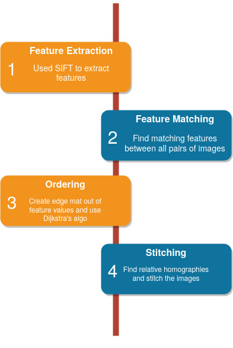
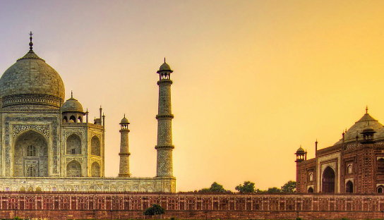
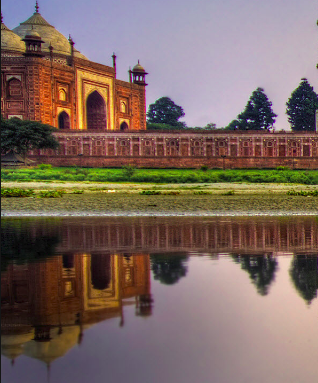
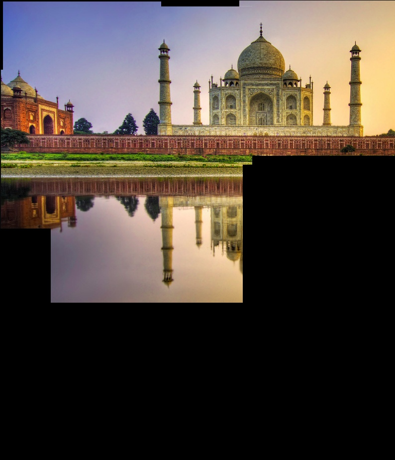

# Algorithm

# Requirements
1. scipy
2. matplotlib
3. numpy
4. opencv-contrib-python 3.4.2.17

# Execution Instructions
`python run.py [list of images] -o [output file]`

# Results
## Inputs

## Output
