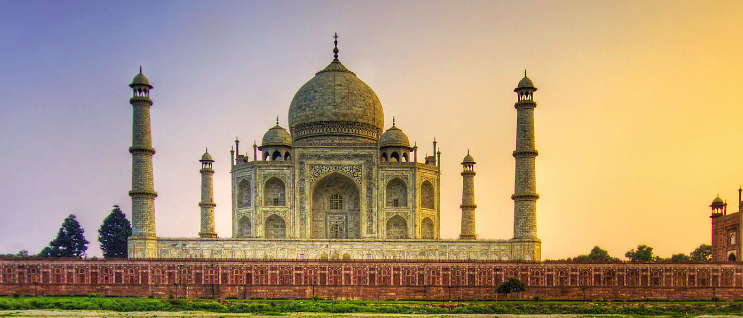
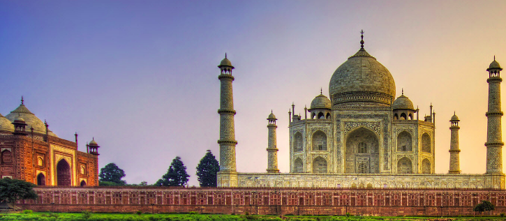
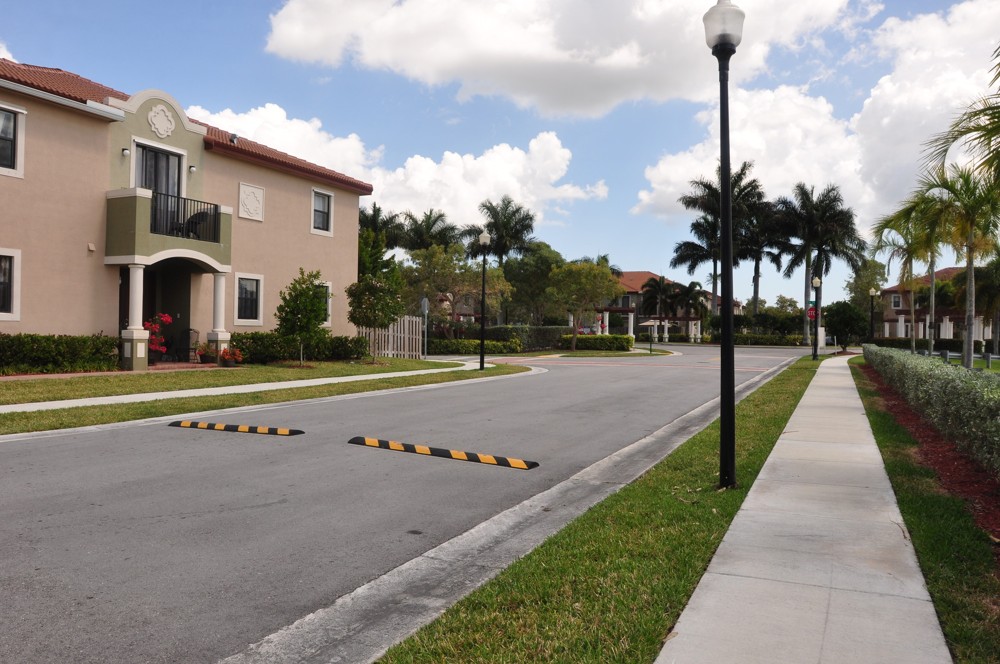
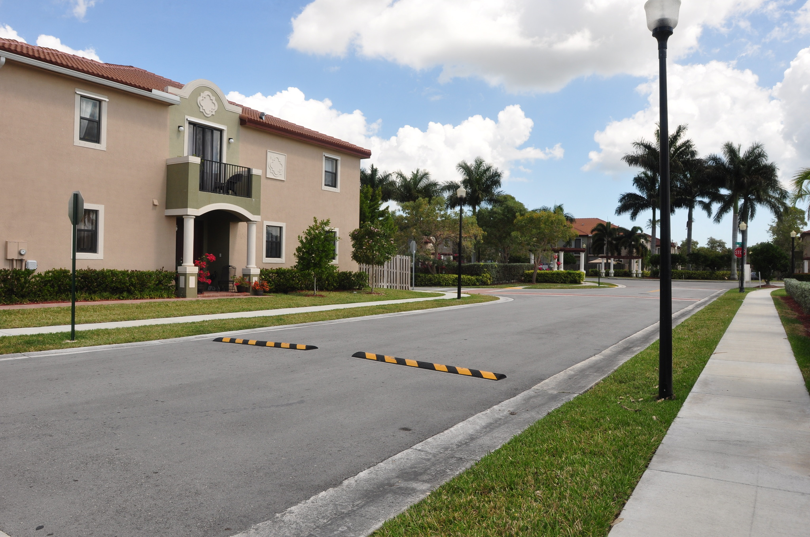
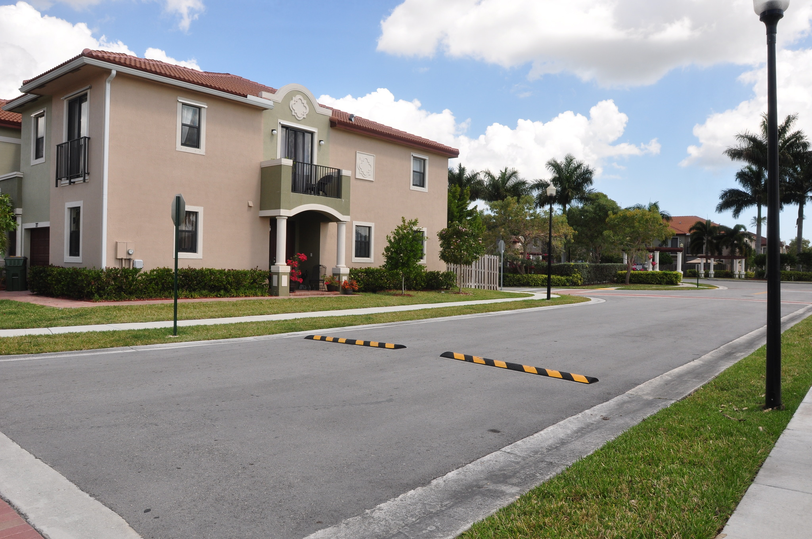
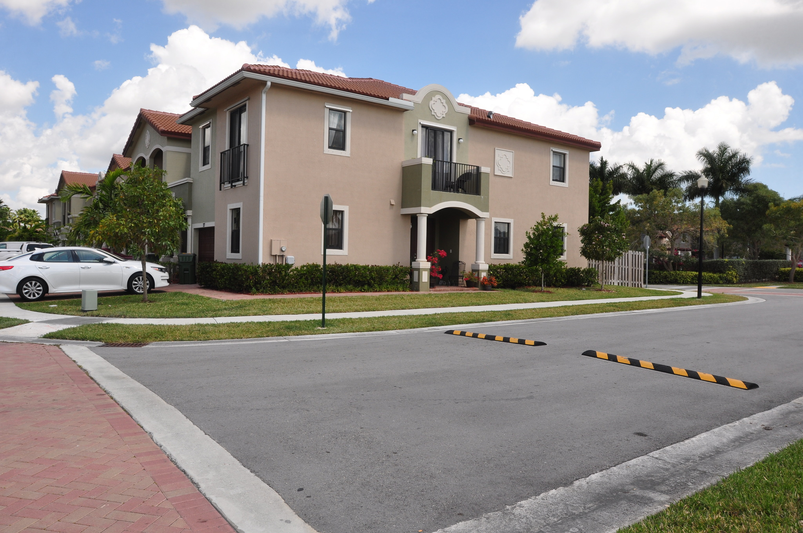
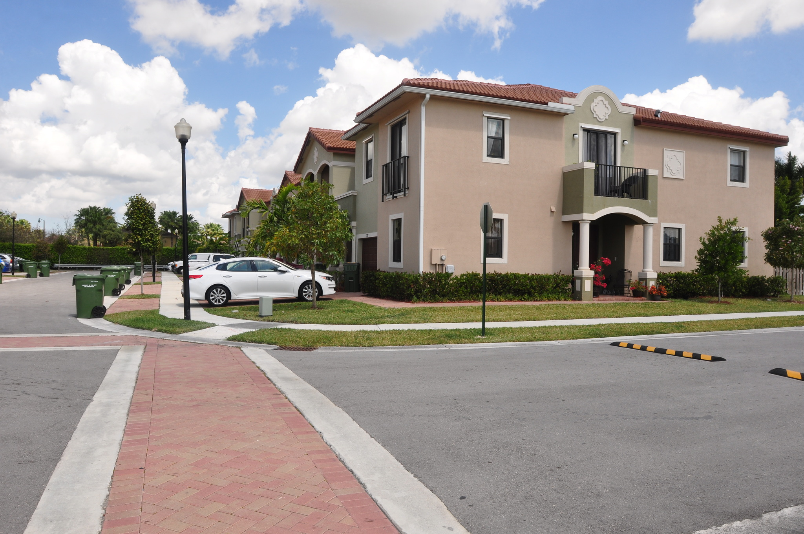
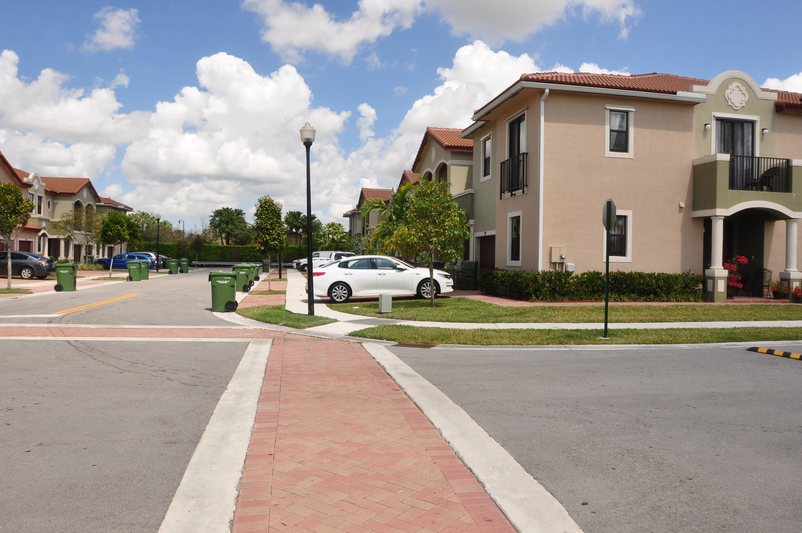
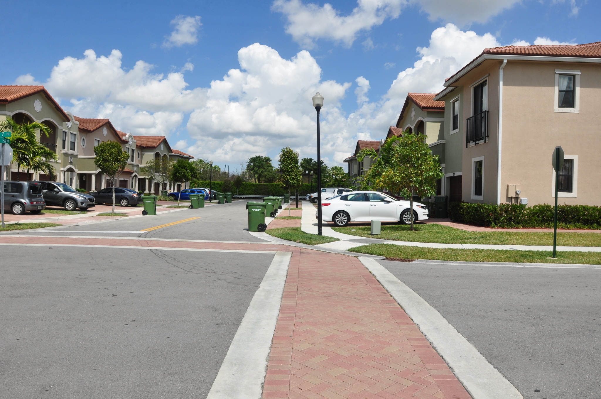

# AutoPanorama
Implementation of IJCV 2007 David Lowe (Automatic Panoramic Image Stitching using Invariant Features)

# Requirements
1. scipy
2. matplotlib
3. numpy
4. opencv-contrib-python 3.4.2.17

# Execution Instructions
`python3 run.py demo/* -o output.png -n 2 -f 1`

#### n -> Number of different panoramas in the input
#### f => 1 SIFT Features
#### f => 2 Dense SIFT Feature
#### f => 3 Window based Correlation Feature

# PROBLEM STATEMENT:
This project concerns the problem of automatic panoramic image stitching. Though the 1D problem (single axis of rotation) is well studied, 2D or multi-row stitching is more difficult. Previous approaches have used human input or restrictions on the image sequence in order to establish matching images. In this work, we formulate stitching as a multi-image matching problem, and use invariant local features to find matches between all of the images. Because of this our method is insensitive to the ordering, orientation, scale and illumination of the input images. It is also insensitive to noise images that are not part of a panorama, and can recognise multiple panoramas in an unordered image dataset.

# INTRODUCTION:
Panoramic image stitching has an extensive research literature and several commercial applications The basic geometry of the problem is well understood, and consists of estimating a 3 × 3 camera matrix or homography for each image This estimation process needs an initialisation, which is typically provided by user input to approximately align the images, or a fixed image ordering. Our work is novel in that we require no such initialisation to be provided.

In the research literature methods for automatic image alignment and stitching fall broadly into two categories:
1) Direct
2) Feature based

Direct methods have the advantage that they use all of the available image data and hence can provide very accurate registration, but they require a close initialisation.
Feature based registration does not require initialisation, but traditional feature matching methods (e.g., correlation of image patches around Harris corners lack the invariance properties needed to enable reliable matching of arbitrary panoramic image sequences.

 In this paper we describe an invariant feature based approach to fully automatic panoramic image stitching. This has several advantages over previous approaches. 

1) Our use of invariant features enables reliable matching of panoramic image sequences despite rotation, zoom and illumination change in the input images.
2) By viewing image stitching as a multi-image matching problem, we can automatically discover the matching relationships between the images, and recognise panoramas even when the images are fed in an unordered manner.
3) The concept of matching relationships between the images and recognizing panoramas can be extended to multiple panorama where there exist a bunch of images belonging to different panoramas and our approach can create different panoramas out of it.
4) We also go one step further to solve the problem to  automatically straighten out the the panoramic images thus removing the black pixels.

# CLUSTERING MODEL FOR IMAGE MATCH VERIFICATION INTRA CLASS:
In order to acquire unordered images belonging to the same panorama we need to separate images and cluster the images belonging to same class. We approach this as a clustering problem and try to solve it through spectral clustering. 

Spectral clustering techniques make use of the spectrum (eigenvalues) of the similarity matrix of the data to perform dimensionality reduction before clustering in fewer dimensions. The similarity matrix is provided as an input and consists of a quantitative assessment of the relative similarity of each pair of points in the dataset.  
The general approach to spectral clustering is to use a standard clustering method on relevant eigenvectors of a Laplacian matrix. There are many different ways to define a Laplacian which have different mathematical interpretations, and so the clustering will also have different interpretations. The eigenvectors that are relevant are the ones that correspond to smallest several eigenvalues of the Laplacian except for the smallest eigenvalue which will have a value of 0. For computational efficiency, these eigenvectors are often computed as the eigenvectors corresponding to the largest several eigenvalues of a function of the Laplacian. 

# Algorithm

Input : n unordered images (belonging to the same panorama)

1) Extract SIFT Features from all n images.
2)Find Matching Features between each pair of images.
3) Now subtract the biggest number found from all the numbers and then create an adjacency matrix which will act as an edge matrix of n*n size and is a lower triangular matrix with the diagonal as well as zero.
4) In the edge matrix create using dijkstra’s algorithm solve for the shortest route to find the order between the unordered images.
5) Find the relative Homographies according to the found order and stitch images in the same order.

Output: Panorama Image

# Results
## Inputs

## Output

## Inputs

## Outputs

